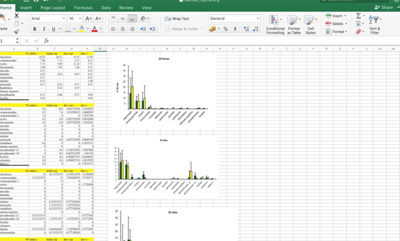
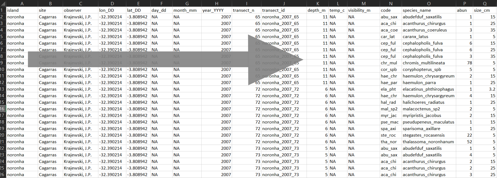
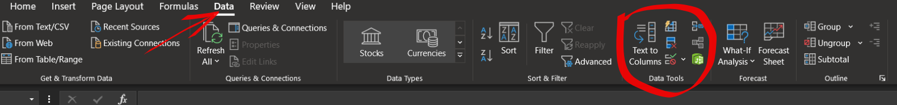
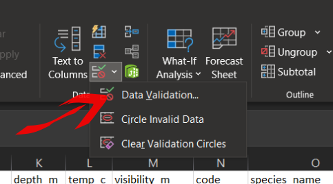
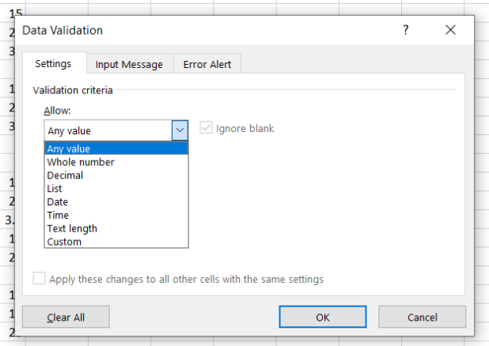
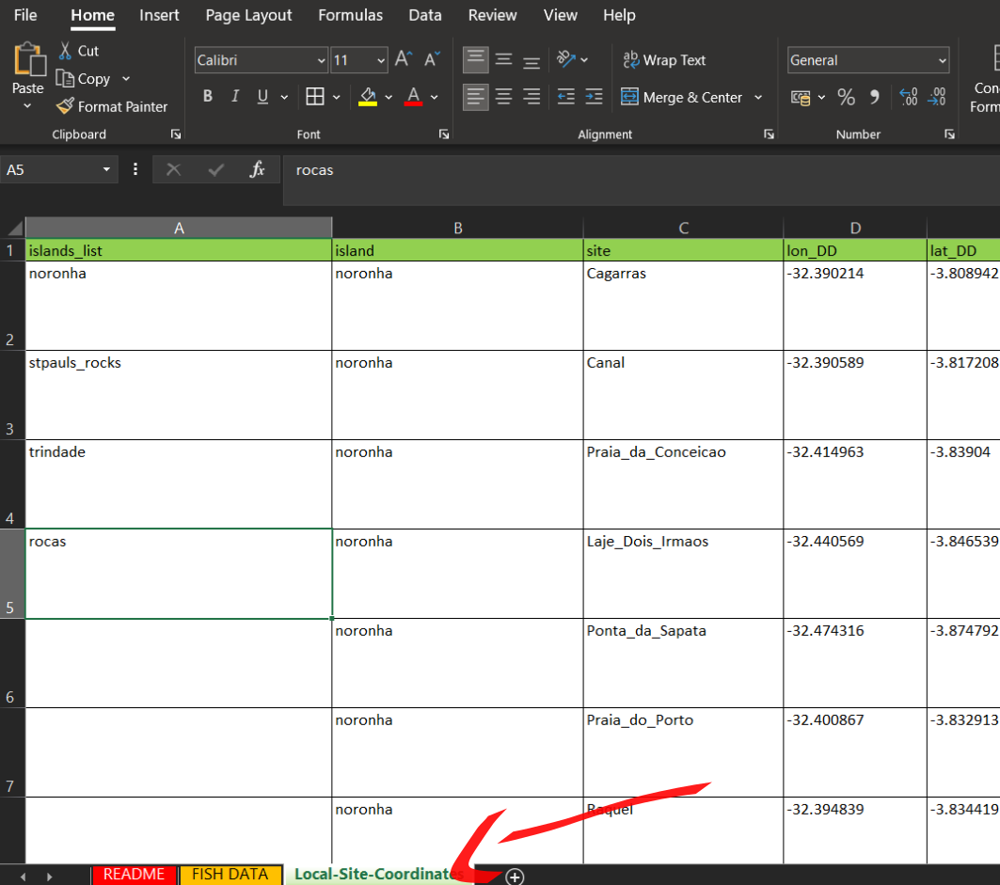
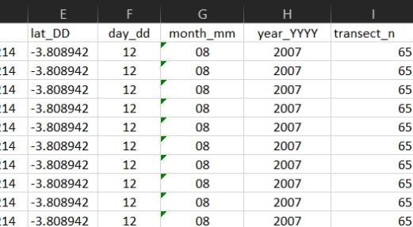
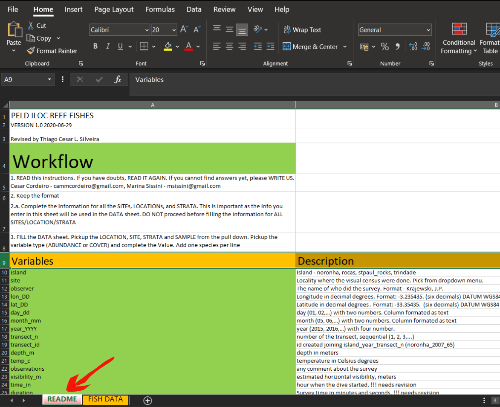

<style>
body {
text-align: justify}
</style>

```{r setup, include=FALSE}
knitr::opts_chunk$set(echo = TRUE)
remotes::install_github("mitchelloharawild/icons")
library(icons)
library(tidyverse)

```

```{r, include=FALSE}
icon_alert   <- icons::fontawesome$solid$`exclamation-triangle`
```

# 1. Introdução

Todo e qualquer projeto de pesquisa terá como uma parte importante a coleta de dados. Os dados obtidos em amostragens (organismos bentos, peixes recifas,...) são de alguma maneira registrados em campo e posteriormente digitalizados em forma de planilhas (excel, e.g.). Após a digitação dos dados, o passo seguinte é explorarmos de alguma maneira estas informações. As informações podem ser visualizadas em gráficos em tabelas...  

No entanto, a leitura dos dados pelo olhar humano e a leitura realizada por uma "máquina" são realizadas de maneiras completamente distintas. A leitura humana de planilhas é visual, tendemos a destacar informações com cores e tabulações etc... Já a leitura dos dados realizada por algoritmos opera de uma maneira completamente diferente.   

Para que possamos processar os dados coletados, primeiramente estes devem ser lidos por algoritmos de maneira correta. Sendo realizada a leitura precisamos ainda estruturá-los de forma que possam ser lidos, formatados e recodificados para a leitura humana. Exitem inúmeras maneiras organizar um banco de dados e algumas estruturas de dados se tornam quase impossívei de ler e manipular.
Nesse sentido, o objetivo desta sessão e apresentar um guia de boas práticas de formatação de planilhas de dados possibilitando uma fácil leitura e manipulação.   


*Dados desorganizados não tem serventia alguma (tidy: "Given to keeping things clean and in order")*


# 2. Objetivos específicos

  + Apresentar um guia de estruturação de banco de dados que possa ser lido por qualquer algoritmo
  + Identificar diferentes formatos de dados
  + Identificar possíveis armadilhas no momento da digitação 
  + Apresentar estratégias para minimização de erros de digitação
  + Tornar o seu banco de dados compreessível por qualquer pessoa

***

# 3. Estruturação de Planilhas

## 3.1 Leitura Humana vs. Leitura dos Computadores

Tenha em mente que o processo do uso da informação em pesquisas apresenta etapas bem distintas.

+ Aquisição - Obtenção propriamente dita dos dados (coletas, fotos, entrevistas,...)
+ Organização - Organização da informação para que possa ser lida e interpretada (logica no armazenamento: estrutura dos dados)
+ Visualização - Produção de gráficos e tabelas com os dados obtidos
+ Modelagem - Emprego de análises estatísticas, construção de modelos e testes de hipóteses.
+ Comunicação - Resultados dos passos anteriores
<br><br>
  


*Etapas do processamento da informação [R for Data Science](https://r4ds.had.co.nz)*
<br><br>
  

`r icon_alert`Desta maneira, quando estiver estruturando seu banco de dados, não pule etapas ou mesmo misture estes passos em uma planilhas do excel. Isto torna a informação inviável de ser acessada por outros meios de leitura (R software, e.g.). Muitas vezes nos sentimos tentados a fazer uma formatação gráfica ou uma visual no excel, mas estas não contribuirão para a manipulação e visualização das informações.
<br><br>
  


*Evite planilhas de dados "mistos"*
<br><br>
  

Portanto, tente executar uma etapa de cada vez e evite misturar dados coletados com tentativas de visualização, análises estatísticas e formatações visuais.
<br><br>
  

## 3.2 Formatos

Existem diversas maneiras de organizar um banco de dados e alguns formatos são muito difíceis de intepretar e manipular. Abaixo são apresentadas algumas formas de organização de dados de um mesmo conjunto de informações.  
<br><br>
  
```{r}
table1
```

```{r}
table2
```

```{r}
table3
```

```{r}
# Dados apresentados em duas planilhas ou "tibbles"
table4a
```

```{r}
table4b
```
<br><br>
  
Analisando os conjuntos de dados acima, qual você julga ser o mais fácil de ler e interpretar? Provavelmente você escolheu a `table1`. Esta conformação de dados é maneira mais simples e fácil de manipular. Este formato também é conhecido pelo formato "longo". Os outros formatos são possíveis de serem manipulados, mas esta tarefa pode ser bem mais desafiadora.  


O tipo de organização apresentada no primeiro exemplo é denominda por Wickham e Grolemund (2017) como "tidy data".Esta organização de dados é regida por três regras:  

+ Cada variável deve ter sua própria coluna

+ Cada observação deve ter sua própria linha

+ Cada valor único deve ter sua própria célula


*As três regras para um conjunto de dados "tidy" [R for Data Science](https://r4ds.had.co.nz)*


`r icon_alert`**Se um conjunto de dados seguir estas três regras, o processamento da informação será muito mais fácil.**
<br><br>
  

Existem outros tipos de arranjos de dados e um dos formatos que rotineiramente precisamos para análises estatísticas é o formato "largo", ou uma **tabela de dados**. Neste formato cada linha é uma unidade amostral e as colunas são as variáveis. Cada unidade amostral adicionada acrescenta uma linha para baixo. Cada variável adicionada acrescenta uma coluna a esquerda. Este formato é o utilizado na grande maioria das análises estatísticas e geralmente advém de uma banco de dados em formato "tidy". 

`r icon_alert` Portanto, quando falamos em bancos de dados, estamos nos referindo a um conjunto de informações que podem ser transformadas em **tabelas**. Ainda, os bancos de dados podem apresentar estruturas bem complexas e com diferentes arranjos. Para os nossos problemas diários, nos referimos nesta seção a simples arquivos com uma lógica de armazenamento que permite o fácil acesso e manipulação.  

Imagine a construção de uma tabela com os dados da `table1` onde queremos a soma dos casos em cada país nos anos 1999 e 2000.

```{r}
# Criando uma tabela com a soma de casos nos países 
taxa_table1_df = table1 %>% 
  group_by(country) %>% 
  summarize(sum_cases = sum(cases))
taxa_table1_df

```

Essa é uma demonstração de criação e uma tabela larga oriunda de um banco de dados "tidy".   
<br><br>
  

## 3.3 Lógica de Construção Hierárquica

O emprego de uma lógica hierárquica na construção dos bancos de dados ajuda muito no momento da digitação dos dados e na sua compreessão quanto a estrutura. Entende-se por lógica hirárquica a estruturação do banco de dados com as colunas a esquerda com variáveis mais abrangentes e colunas com maior detalhamento sendo adicionadas a esquerda.  

Abaixo um exemplo baseado nos dados de peixes recifais.



*Hierarquia quanto a abrangência das variáveis*

No exemplo, vemos que as colunas mais a esquerda representam as ilhas e locais nas ilhas. Ao passo que as colunas vão sendo acrescentadas, as variáveis começam a detalhar cada vez mais a informação (coordenadas, profundidade, espécies, etc...)
<br><br>
  

## 3.4 Nomes de Variáveis

**Nomes de variáveis** são uma informação chave para que o banco de dados seja lido com maior facilidade por qualquer pessoa. Nomes muito abreviados ou com informação incompleta tendem a dificultar o preenchimento das planilhas e a compreenssão.  

A sugestão é utilizar **nomes curtos e informativos**. Por exemplo, um bom nome para a variável temperatua pode ser "temp", nome curto e informativo. No entanto, com esse nome não está explícita a unidade da variável. Uma sugestão que atenderia requisitos de simplicidade com informação completa poderia ser "temp_c", temperatura em graus Celsius.   


Abaixo algumas sugestões de nomes de variáveis:

| Variável                             | Boa opção          | Evitar             |
|:-----------------------------------: |:------------------:|:------------------:|
| Temperatura máxima (graus Celsius)   | max_temp_c         | Maximun Temp (C°)  |
| Precipitação (mm)                    | precip_mm          | prec               |
| Massa (Kg)                           | massa_kg           | Massa (Kg)         |
| Visibilidade horizontal (metros)     | vis_hrz_m          | visib (m)          | 
| Latitude (graus decimais)            | lat_DD             | lat                |


Em resumo:
+ Nomes curtos e informativos - informando variável e unidade
+ Evitar espaços em branco
+ Evitar caracteres especiais (acentos, ", # e º, por exemplo)
+ Evitar mistura caixa alta com caixa baixa
<br><br>
  

## 3.5 Consistência de formato de variáveis 

As variáveis em um banco de dados podem ser de diferentes tipos (categóricas, numéricas, continuas, por exemplo). Para evitar problemas com a manipulação e processamento é preciso prestar atenção ao formato e ser consistente.


`r icon_alert`Principais problemas:

+ Separador do decimal (vírgula ou ponto)
+ Estado de variáveis - ("noronha" é diferente de "Noronha")

Uma ferramenta do Excel que pode ajudar a evitar erros de digitação encontra-se na aba Dados => Validação de Dados.
<br>
 







Na opção "Validação de Dados" estarão disponíveis algumas ferramentas para controle do que pode ser preenchido nas células.





A validação de dados pode ser realizada de diferentes maneiras:

+ Permitindo somente números inteiros
+ Somente decimais
+ Seguido itens de uma lista (útil para nomes de espécies, localidades, coordenadas e nomes de quem amostrou/processou)
+ Tempo, data, etc...

Ainda podem ser adiciondas mensagens de *input* e *error*. 


Para usar recurso de lista do Excel é preciso ter uma aba com as listas que serão usadas. Ter uma aba no mesmo arquivo com a lista de ilhas, locais, coordendas para cada local e espécies com os nomes conferidos ajuda muito a evitar erros de digitação.


<br><br>
  


## 3.6 Datas

Quanto a inserção de datas, sugere-se que se separe os valores de dia, mês e ano. Outros formatos também podem ser eficientes (11-05-2021, por exemplo),  mas devem ter consistência em todo o banco de dados. Havendo uma coluna para dia, mes e ano, evita-se confusões de formato dia/mes/ano ou mes/dia/ano, por exemplo.    


<br><br>
  


## 3.7 Arquivo README

Outra estratégia para evitar erros de digitação e tornar a informação de fácil compreenssão para pessoas é ter sempre disponível com os dados um arquivo, ou uma aba no excel, **README**. Estes arquivos são informações que não fazem parte do banco de dados, mas ajudam na comprenssão do que é apresentado.  

Neste tipo de arquivo, que podem ser chamados também de *metadados*, podem ser apresentadas as seguintes informações:

+ Como foram obtidas as variáveis
+ Explicação contendo a unidade das variáveis
+ Data da última atualização da base de dados
+ Como incorporar novos dados


<br><br>

Exemplo arquivo [**README refazer**](https://kkkgithub.com/peld-iloc/data_example/blob/main/peld_iloc_peixes_recifais_EXEMPLO_Thiago_Silveira_2020_08_11.zip)    

## 3.8 Ausência de informação 

A ausência de uma informação em um banco de dados não quer dizer que ela é zero, e sim que esta não está acessível ou **não foi amostrada**. A recomendação é que sempre se use **Na** quando uma informação não estiver disponível. Simplesmente deixar em **branco** pode gerar confusão. pois não se sabe se foi esquecimento ou de fato um **Na**. 

## 3.9 Controle de Versão

O controle de versão da informação é uma prática muito importante e tornar isto parte do seu dia-a-dia pode evitar problemas futuros. Uma simples ação que pode ser empregada é **nunca alterar os dados originais**. Sempre que tiver um banco de dados em mãos, salve com outro nome e faça edições.  

Outro cuidado que pode ser tomado também é seguir uma lógica de nomeação de arquivos. Procurar ser o mais informativo possíve,l ajuda a organizar os arquivos e o acesso a informação.  

Abaixo algumas sugestões de nomeação de arquivos:

| Nome pouco informativo               | Sugestão                                             |
|:------------------------------------:|:----------------------------------------------------:|
| dados_monitoramento.xlsx             | monitoramento_ThiagoS_2021_07_27.xlsx                |            
| dados_energia.xlsx                   | energia_MarceloC_2021_07_27.xlsx                     |  
| data_final_larvas.xlsx               | larvas_AndreaG_2021_07_27.xlsx                       |

<br><br>

***

# 4. Referências e links úteis

Wickham, H. & Grolemund, G. R for Data Science - import, tidy, transform, visualize, and model data. (O’Reilly Media, 2017).

https://datacarpentry.org/spreadsheet-ecology-lesson/