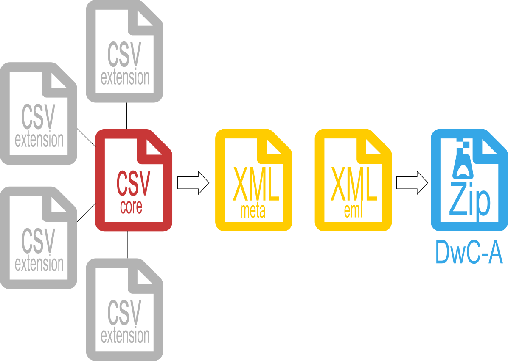

<style>
body {
text-align: justify}
</style>

## 1. Darwin Core Archive

O Darwin Core Archive (DwC-A) é o arquivo padrão para publicação de dados da biodiversidade usando os [**termos**](http://rs.tdwg.org/dwc/terms.htm#samplingProtocol) Darwin Core. Este formato de arquivo é o padrão para publicação de dados no [**OBIS**](https://obis.org/) e [**GBIF**](https://www.gbif.org/).  

O modelo de organização do Darwin Core Archive é descrito como um esquema de estrela com uma única tabela **core**, esta contendo occorrências ou eventos no centro da estrela. Outras tabelas podem ser associadas a tabela **core**, estas podem trazer outras informações associadas aos registros de ocorrências como: densidade, método de coleta, temperatura, dentre outras. Juntamente com os componentes DwC-A são adicionados também dois arquivos XML: um descreve o arquivo e a estrutura dos dados, **meta.xml**, e o outro contêm os metadados. **eml.xml**. Ao final todos estes componentes são transformados em uma pasta zip. Toda documentação a respeito do **DwC-A** está disponível no [Darwin Core text guide](https://dwc.tdwg.org/text/). 
<br><br>
  



<br><br><br>
*Estrutura de um Darwin Core Archive*   
<br><br>
  

## 2. Publicação dos Dados da biodiversidade no OBIS/GBIF

A publicação dos dados da biodiversidade amostrada pelo **PELD-ILOC** visa atender a [**Resolução Normativa 009/16**](http://www.cnpq.br/web/guest/view/-/journal_content/56_INSTANCE_0oED/10157/4621110) que intitui a Política de Dados do Programa de **Pesquisa Ecológica de Longa Duração (PELD)**. O objetivo desta RN é regulamentar as formas de disponibilização, acesso e uso dos dados gerados pelos pesquisadores da rede PELD.

Considerando a importância dos dados coletados no âmbito **PELD-ILOC** e a sua importância para a gestão ambiental, estes devem estar disponíveis para a sociedade. Além disso, o PELD é membro [International Long Term Ecological Research (ILTER)](https://lternet.edu/international/) e o [Global Biodiversity Information Facility (GBIF)](https://www.gbif.org/).

Tendo em vista a importância dos dados obtidos até o momento, é de extrema importância que estes estejam **organizados e conferidos**. Desata maneira é garantida a qualidade dos dados publicados, bem como fica otimizada a curadoria e processamento destes para publicação nos repositórios de dados da biodiversidade. 
<br><br>
  
***

## 3. Construção do DwC-A a partir de dados do PELD-ILOC (Peixes Recifais)

Este item visa apresentar um exemplo de conversão de um arquivo em formato **tidy**, ou longo, para os arquivos necessários na criação de um **Darwin Core Archive (DwC-A)**. Para reproduzir o exemplo acesse uma amostra dos dados fictícios [neste repositório](https://github.com/peld-iloc/DwC-A_example). Os scripts usados para a construção dos **DwC-As** dos dados do **PELD-ILOC** estarão disponíveis no **Github** em repositórios privados. 
<br><br>
  

### 3.1 Importando os Dados

```{r eval=FALSE}
rm(list = ls())

library(tidyverse)

# insert you directory
baseDir = "diretorio onde estão os dados"

# file name
fish_data= "peld_iloc_peixes_recifais_EXEMPLO_Thiago_Silveira_2020_08_11.csv"
coords_data = "Peld_Site_Coordinates_2021_07_12.csv"

DF.sites = read_delim(file.path(baseDir, fish_data),
             na="NA",
             delim = ",",
             skip_empty_rows = TRUE)
spec(DF.sites)
glimpse(DF.sites)

DF.coords = read_delim(file.path(baseDir, coords_data),
             na="NA",
             delim = ",",
             skip_empty_rows = TRUE)
spec(DF.coords)
glimpse(DF.coords)
```
<br><br>
  
### 3.2 Correção de coordenadas

Devido ao formato incorreto das coordenadas (ex .: lon -32.234.234 | lat 3.808.942) foi identificada a necessidade de uma verificação substancial em todas as coordenadas e nomes de sites apresentados no arquivo original. Após uma primeira verificação, foram identificados formatos decimais incorretos (ex .: -33.345.323, ...) e valores invertidos para latitude e longitude.

Para corrigir os nomes e coordenadas dos sites, foi criada uma planilha contendo os nomes e coordenadas corrigidos para todos os sites pesquisados[(diponível aqui)](https://github.com/peld-iloc/site_coordinates). As correções foram realizadas por meio de inspeção nas ortofotografias e comunicação pessoal com os pesquisadores do **PELD-ILOC**. Além disso, comparamos as coordenadas disponíveis com os mapas apresentados nas publicações Longo et al. (2015) e Krajewski e Floeter (2011). Após a verificação das coordenadas e nomes dos sites, foi criada uma planilha com os dados corrigidos, aqui denominada **DF.coords** no script.
<br>
 

```{r eval=FALSE}
DF.coords

# Joining the tables using as reference the site (DF.sites) and site_coords (DF.coords)
DF.sites = DF.sites%>%
  left_join(DF.coords, by = c("site" = "site_coord"), copy = TRUE)
  
# Reordering DF.sites with the corrected coordinates and site names
DF.sites = DF.sites %>% 
  select(c(-site, -lon_DD, -lat_DD, -island_coord, -checking_status, -Obs)) %>% 
  relocate(c(lon_DD_coord, lat_DD_coord), .after = observer)  %>%
  relocate(New_name_coord, .after = island) 


DF.sites = DF.sites %>% 
dplyr::rename(site = New_name_coord,
              lon_DD = lon_DD_coord,
              lat_DD = lat_DD_coord)
DF.sites
```
<br><br>
  
### 3.3 Tabela Event Core

A tabela **event Core** armazena as informações sobre o evento de amostragem. Todas as informações sobre o evento de amostragem, **event Core**, estão vinculadas aos eventos registrados em **eventID**. O **eventID** consiste na combinação de ilha-ano-transect_number (ex.: noronha_2007_65). As próximas informações consideradas foram **eventDate**, data de amostragem formatada como AAAA-mm-dd, AAAA-mm ou AAAA. O registro completo da data assumiu formatos distintos devido à ausência das informações nos dados originais, arquivo excel. Como nem todas as amostragens foram realizadas no mesmo dia, para cada transecto, o **eventDate** foi preenchido no nível **transect_ID**.  

A latitude e a longitude, **em graus decimais**, foram extraídas dos dados originais. Como os locais de amostragem ocorreram em ilhas diferentes com um ponto fixo, podemos preencher **decimalLongitude** e **decimalLatitude** no evento de nível de site. O censo visual varia em profundidade no mesmo local, então incorporamos o termo **maximumDepthInMeters**, preenchendo o registro de profundidade no nível do transecto do local.

A lista de **core term**  definidos pelo Darwin Core mostra os termos que descrevem a localização como **island**, nos dados do excel esta informação é descrita como **locality**. Além disso, os principais dados são descritos na coluna **site** como o nome do local levantado em cada ilha, portanto usamos esta informação como **site**. 

- Dados disponíveis na planilha:
  + eventID: "transect_ID" - ex. noronha_2007_65 (island_year_transect_number)
  + eventDate:  YYYY-mm-dd, YYYY-mm or YYYY
  + decimalLatitude: -3.00 (e.g.: -3.808942);
  + decimalLongitude:  -32.0 (e.g.: -32.390214); 
  + island: island name 
  + locality: site name
  + georeferenceProtocol: core term presenting "description or reference to the methods used to determine the spatial footprint, coordinates, and uncertainties".

- Informações adicionais adicionadas com este script: 
  + samplingProtocol: "Underwater Visual Survey - 50 meters x 2 meters transects"
  + samplingEffort: "one observer by 50x2 underwater visual survey"
  + sampleSizeValue: "100"
  + sampleSizeUnit: "square meter"
  + geodeticDatum: "WGS84"
  + verbatimCoordinateSystem: "decimal degrees"
  + Country: "Brazil"
  + countryCode: "BR"
  

```{r eval=FALSE}
# Data from long format data - Reshape Data

#Creating a data column handling missing months and days as "Date"
DF.sites = DF.sites %>%
    mutate(across(everything(), as.character))%>%
    mutate(Date = ifelse(is.na(year_YYYY) == FALSE & is.na(month_mm) == TRUE & is.na(day_dd) == TRUE, year_YYYY,
                          ifelse(is.na(year_YYYY) == FALSE & is.na(month_mm) == FALSE & is.na(day_dd) == TRUE, paste(year_YYYY,month_mm, sep="-"),
                            ifelse(is.na(year_YYYY) == FALSE & is.na(month_mm) == FALSE & is.na(day_dd) == FALSE, 
                                   paste(year_YYYY,month_mm, day_dd, sep = "-"), paste("NA"))))) %>% 
    arrange(as.integer(transect_n))

DF.sites


# Aggregating by unique transect_id, locality, site, Date, lat_DD, lon_DD
DF.event = DF.sites %>%
    dplyr::group_by(transect_id, island, site, Date, depth_m, lat_DD, lon_DD)

# changing column names to DwC-A terms
event_core = DF.event %>%
  dplyr::rename(eventID = transect_id, 
     locality = site,
     eventDate = Date,
     maximumDepthInMeters = depth_m,
     decimalLatitude = lat_DD,
     decimalLongitude = lon_DD) %>%
    dplyr::select(eventID, island, locality, eventDate,maximumDepthInMeters, decimalLatitude, decimalLongitude,  georeferenceProtocol)

  
# Pasting Additional information 
event_core = event_core %>% 
    add_column(samplingProtocol = "Underwater Visual Survey - 20 meters x 2 meters transects",
    samplingEffort = "one observer by 20 meters x 2 meters Underwater Visual Survey",
    sampleSizeValue = "40",
    sampleSizeUnit = "square meter",
    geodeticDatum = "WGS84",
    verbatimCoordinateSystem = "decimal degrees",
    Country = "Brazil",
    countryCode = "BR") 

# Formatting - Islands names
event_core = event_core %>%
    mutate(island = stringr::str_replace_all(island, pattern = "noronha", replacement = "Fernado de Noronha")) %>% 
    mutate(island = stringr::str_replace_all(island, pattern = "rocas", replacement = "Atol das Rocas")) %>% 
    mutate(island = stringr::str_replace_all(island, pattern = "stpauls_rocks", replacement = "São Pedro e São Paulo")) %>% 
    mutate(island = stringr::str_replace_all(island, pattern = "trindade", replacement = "Trindade")) 

# Formatting - locality - taking off "_" and capitalizing the first letter
# special characters
# unique(as.factor(event_core$locality)) for mapping locality names
event_core = event_core %>%
    mutate(locality = str_replace_all(locality, pattern = "_", replacement = " ")) %>% 
    mutate(locality = stringr::str_replace_all(island, pattern = "Praia da Conceicao", replacement = "Praia da Conceição")) %>% 
    mutate(locality = stringr::str_replace_all(island, pattern = "Laje Dois Irmaos", replacement = "Laje Dois Irmãos")) %>% 
    mutate(locality = stringr::str_replace_all(island, pattern = " Cemiterio", replacement = " Cemitério")) %>% 
    mutate(locality = stringr::str_replace_all(island, pattern = "Salao", replacement = "Salão")) %>% 
    mutate(locality = stringr::str_replace_all(island, pattern = "Cabeco Tartaruga", replacement = "Cabeço Tartaruga")) %>% 
    mutate(locality = stringr::str_replace_all(island, pattern = "Boia", replacement = "Bóia")) %>% 
    mutate(locality = stringr::str_replace_all(island, pattern = "Naufragio", replacement = "Naufrágio")) %>% 
    mutate(locality = stringr::str_replace_all(island, pattern = "Tunel", replacement = "Túnel")) %>% 
    mutate(locality = stringr::str_replace_all(island, pattern = "Farilhoes", replacement = "Farilhões")) %>% 
    mutate(locality = stringr::str_replace_all(island, pattern = "Paredao", replacement = "Paredão"))
    
rm(DF.event)

event_core
```
<br><br>
  

### 3.4 Tabela Occurrence Extension

A próxima tabela tem os nomes científicos como **cientificName** e os códigos de espécies listados em **taxonID**. Novamente, todas as ocorrências estão vinculadas ao respectivo transecto, nesta tabela a referência ao transecto é chamada de **id**. Na coluna id da tabela, esta faz referência aos eventos na tabela principal. Cada ocorrência, cada espécie, é rotulada como **ocorrenceID** seguindo como registros sequenciais (occ_1, occ_2, ...).

Antes da tabela final, todas as espécies foram validadas usando a função **wormsbynames** (pacote worms). Todos os registros com problemas relativos a nomes foram verificados com os especialistas do PELD-ILOC. Além disso, criamos a coluna *taxonRank* indicando a classificação em espécie ou gênero. 

Note que não temos como inserir especies como **Malacoctenus_sp1** ou **Malacoctenus_sp1**. Estes dados ficam de referência interna para os pesquisadores do **PELD-ILOC** e para a construção desta parte da tabela a classificação ficou em **gênero**. Algumas espécies não estão no worms (ex.: *Menaphorus punticulatus*) e foi detectada pelo procedimento. Neste caso, esta foi confirmada manualmente.
<br><br>
    
```{r eval=FALSE}

library(worms)

# Getting species and transect_id
DF.occ = DF.sites %>%
    arrange(as.integer(transect_n)) %>% 
    select(transect_id, transect_n, species_name, observer, abun, size_cm, temp_c)

# adding occurrenceID as occ_n and changing names
DF.occ = DF.occ %>% 
    add_column( occurrenceID = paste0(DF.occ$transect_id,"_","occ_",row.names(DF.occ))) %>% 
    select(-transect_n) 
    
# editing names
DF.occ = DF.occ %>% 
    mutate(species_name = str_replace_all(species_name, pattern = "_", replacement = " ")) %>% 
    mutate(species_name  = str_to_sentence(species_name, locale = "pt")) %>% 
    relocate(occurrenceID, .after= transect_id)


library(worms)
sp_Names = unique(DF.occ$species_name)
scNames_rank = wormsbynames(sp_Names, verbose = F)

# malacoctenus_sp1                                     no match                                 
# kyphosus_spp                                         no match                                 
# menaphorus_punticulatus                              no match                                 
# entomacrodus_spp                                     no match                                 
# coryphopterus_spb                                    no match                                 
# sparisoma_spp                                        no match                                 
# malacoctenus_sp2                                     no match                                 
# malacoctenus_sp3                                     no match                                 
# ophioblennius_spp                                    no match   


# Changing names in DF.occ 
DF.occ = DF.occ %>%
    mutate(species_name = str_replace_all(species_name, pattern = "Coryphopterus spb", replacement = "Coryphopterus")) %>% # genus
    mutate(species_name = str_replace_all(species_name, pattern = "Entomacrodus spp", replacement = "Entomacrodus")) %>%  # genus
    mutate(species_name = str_replace_all(species_name, pattern = "Kyphosus spp", replacement = "Kyphosus")) %>% # genus
    mutate(species_name = str_replace_all(species_name, pattern = "Malacoctenus sp1", replacement = "Malacoctenus")) %>% # genus
    mutate(species_name = str_replace_all(species_name, pattern = "Malacoctenus sp2", replacement = "Malacoctenus")) %>% # genus
    mutate(species_name = str_replace_all(species_name, pattern = "Malacoctenus sp3", replacement = "Malacoctenus")) %>% # genus 
    mutate(species_name = str_replace_all(species_name, pattern = "Ophioblennius spp", replacement = "Ophioblennius")) %>% # genus
    mutate(species_name = str_replace_all(species_name, pattern = "Sparisoma spp", replacement = "Sparisoma")) # genus

# running again
sp_Names = unique(DF.occ$species_name)
scNames_rank = wormsbynames(sp_Names, verbose = F)

# Not in worms database 
DF.occ %>%
  filter(species_name == "Menaphorus punticulatus")

# Create df for full join
name_cd_rk = scNames_rank %>% 
  select(scientificname, lsid, rank)

DF.occ = DF.occ%>%
  full_join(name_cd_rk, by = c("species_name" = "scientificname" ))

# Checking the existence of issues represented as "NA"
# As expected just for Menaphorus punticulatus, without lsid
DF.occ %>%
  filter(is.na(lsid) == TRUE) 

# Filling rank for Menaphorus punticulatus  
DF.occ = DF.occ %>%
  mutate_at(vars(rank), funs(ifelse(species_name == "Menaphorus punticulatus","Species", . )))

DF.occ %>%
  filter(is.na(rank) == TRUE) #ok


DF.occ = DF.occ %>% 
dplyr::rename(
  scientificName = species_name,
  scientificNameID = lsid,
  taxonRank = rank, 
  recordedBy = observer,
  id = transect_id)


# Adding organismQuantityType and basis of record
DF.occ = DF.occ %>% 
  add_column(organismQuantityType = "number of individuals in 20 meters x 2 meters Underwater Visual Survey",
             basisOfRecord = "Human Observation")

DF.occ_obs_count = DF.occ

DF.occ = DF.occ %>% 
  select(c(-abun, -size_cm, -temp_c))


```
<br><br>
  

### 3.5 Tabela Extended Measurements or Facts

Finalmente, podemos construir a tabela **MeasurementOrFact**. Nesta tabela, descreveremos algumas informações associadas ao **id** e **occurenceID**.

Primeiro adicionaremos o tipo de medição da coluna **measurementValue**, três níveis - abundância, comprimento e profundidade. A próxima informação necessária é **measureUnity** para especificar as unidades densidade, comprimento em centímetros e temperatura em graus celsius. A próxima informação é o valor de medição, os valores observados para densidade e comprimento, no arquivo excel são as colunas **abun** e **size_cm**. Por fim, adicionaremos o termo **recordedBy** indicando quem fez a observação, no arquivo excel definido como **observador**. 
<br><br>
  
```{r eval=FALSE}
#create DF with id, occurenceID, recordedBy, with size_cm, abun and temp_c
DF.eMOF_start = DF.occ_obs_count %>% 
  select(id, occurrenceID, recordedBy, size_cm, abun, temp_c) %>% 
  mutate(recordedBy = str_replace_all(recordedBy, pattern = "_", replacement = " ")) %>% 
  mutate(recordedBy = str_to_title(recordedBy, locale = "pt"))


# Table abundance
#create table  measurementType abundance
#create table  measurementUnity  number of individuals in the transec 
#create measurementValue - abund 

DF.eMOF_abun = DF.eMOF_start %>% 
  select(-size_cm, -temp_c) %>% 
  dplyr::rename(measurementValue ="abun" ) %>% 
  add_column(measurementType = "abundace",
             measurementeUnity = "number of individuals counted on the transect")
            
             
str(DF.eMOF_abun)

# Table length
# create table  measurementType length
# create table  measurementUnity  number of individuals in the transec 
# create table  measurementValue length in cm


DF.eMOF_length = DF.eMOF_start %>% 
  select(-abun, -temp_c) %>% 
  dplyr::rename(measurementValue ="size_cm" ) %>% 
  add_column(measurementType = "length",
             measurementeUnity = "mean centimeters")


#create table  measurementType temperature
#create table  measurementUnity Celsius degrees 
#create table  measurementValue temp_c

DF.eMOF_temp = DF.eMOF_start %>% 
  select(-abun, -size_cm) %>% 
  dplyr::rename(measurementValue = "temp_c") %>% 
  add_column(measurementType = "temperature",
             measurementeUnity = "Celsius degrees")

# Binding rows

DF.eMOF = bind_rows(DF.eMOF_abun, DF.eMOF_length, DF.eMOF_temp)

rm(DF.eMOF_start,DF.eMOF_abun, DF.eMOF_length, DF.eMOF_temp, DF.sites)

```
<br><br>
  

### 3.6 Salvando os DwC-A 
```{r eval=FALSE}
files = list(event_core, DF.occ, DF.eMOF) 
data_names = c("event_core","DF_occ","DF_eMOF")
dir.create("Dwc_Files")


for(i in 1:length(files)) {     
path = paste0(getwd(),"/","DwC_Files")
write_csv(files[[i]], paste0(path,"/",data_names[i],".csv"), )
}

```
<br><br>
  
## 4. Referências

https://obis.org/manual/dataformat/

https://github.com/gbif/ipt/wiki/samplingEventData#templates

https://github.com/gbif/ipt/wiki/samplingEventData#required-dwc-fields

http://rs.tdwg.org/dwc/terms.htm#samplingEffort - Terms description

https://www.tidyverse.org/
<br><br>
  
Krajewski, J. P. & Floeter, S. R. Reef fish community structure of the Fernando de Noronha Archipelago (Equatorial Western Atlantic): The influence of exposure and benthic composition. Environ. Biol. Fishes 92, 25–40 (2011).

Longo, G. O. et al. Between-habitat variation of benthic cover, reef fish assemblage and feeding pressure on the benthos at the only atoll in South Atlantic: Rocas atoll, NE Brazil. PLoS One 10, 1–29 (2015).


