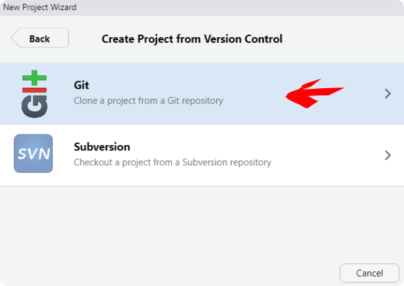

<style>
body {
text-align: justify}
</style>


```{r setup, include = FALSE}
knitr::opts_chunk$set(echo = TRUE)

#remotes::install_github("mitchelloharawild/icons")
library(icons)
icons::download_octicons()
icons::download_fontawesome()

```

```{r, include = FALSE }
icon_commit <- icons::octicons$git_commit
icon_pull   <- icons::fontawesome$solid$`cloud-download-alt`
icon_push   <- icons::fontawesome$solid$`cloud-upload-alt`
icon_merge  <- icons::octicons$git_merge
icon_fork   <- icons::octicons$repo_forked
icon_pr     <- icons::octicons$git_pull_request
icon_clone  <- icons::octicons$repo_clone
icon_branch <- icons::fontawesome$solid$`code-branch`
icon_check   <- icons::fontawesome$solid$`check`
```


# 1. Visão Geral

Com o objetivo de documentar procedimentos e armazenar recursos para processamento, divulgação e análise dos dados obtidos pelo **Projeto Coral Sol** foi idealizada a criação de um perfil no [Github](https://github.com/).

# 2. Indicações de uso

+ Armazenar recursos para curadoria e acesso aos bancos de dados
+ Atuar como um respositório de dados públicos e privados do projeto (sites, web-apps, manuais, algoritmos, etc...)
+ Ser um repositório para o compartilhamento de dados e código entre a equipe 
+ Opção de repositório de dados de publicações 

<br><br>


<br><br>
  

Para quem não está familiarizado com o controle de versão e as ferramentas Git e Github, a seguir é feita uma introdução ao tema.

***

# 3. Introdução ao Controle de Versão


*[Phd Comics](http://phdcomics.com/)*
<br><br>
  

Quem nunca nomeou um arquivo como "final"? Depois de algumas releituras e correções você salva com outro nome, "final_2". Depois desta versão, alguém analisa e faz observações, e você prontamente salva o arquivo como "final_2_fulano_version", e assim por diante. Imagine este mesmo documento ficando na "geladeira" por alguns meses e você quer retornar de onde parou. Ainda existe a opção de alguém fazer alterações e **não mudar o nome do arquivo**. Neste momento fica muito difícil saber onde parou, ainda mais podendo ficar na dúvida de qual é o arquivo mais antigo.  

Nomear arquivos com diferentes nomes é uma maneira intuitiva de se fazer **controle de versão** de arquivos, até pode funcionar para problemas menos complexos. No entanto, quando trabalhamos em grupos de pesquisa, com várias pessoas editando textos e códigos, fica difícil gerenciar o histórico de versões de um arquivo, ainda mais vários. Felizmente, hoje existem ferramentas que nos auxiliam no controle de versão, tanto em nossas máquinas quanto em repositórios *online*.  

***

# 4. Git

Lançado em 2005, [GIT](https://git-scm.com/) é um software de **controle de versão** livre. Esta ferramenta permite o rastreio de alterações em qualquer tipo de conjundo de arquivos. O uso do controle de versão permite velocidade no trabalho e integridade de dados, muito indicado em trabalhos em grupo. Ainda, permite a evolução dos projetos de forma não linear, possibilitando a criação de diferentes abordagens sem comprometer os dados originais. Todo o diretório de arquivos onde o **Git** está operando toda e qualquer mundança é identificada e recuperável.
<br><br>
  


<br><br>
  
Linus Torvalds criou o **Git** para o desenvolvimento do sistema operacional Linux Kernel. Segundo o próprio autor Git significa [Git - The Stupid Content Tracker](https://linux.die.net/man/1/git). Existem outros programas de controle de versão, no momento o Git é um dos mais utilizados pela comunidade de desenvolvedores.  

O controle de versão Git assemlha-se a uma árvore, tendo um ramo principal chamado de `master`. O master pode ter ramos paralelos que podem evoluir juntamente com o `master`, estes são chamados de `branch` `r icon_branch`, e cada um deles tem um nome. Cada círculo na figura corresponde a uma versão do diretório, ou um `commit` `r icon_commit`. Os ramos `branch` `r icon_branch` podem ser criados por diferentes pessoas ou por um mesmo usuário. A aplicação prática da criação de ramos é, por exemplo, explorar diferentes tipos de abordagens estatísticas distintas da usada no `master`.
<br><br>
  

  

*"Branching" em um repositório Git*   
<br><br>
  

Imagine que após alguns testes, os usuários que estão trabalhando neste diretório discutem e avaliam que as contribuições podem ser incorporadas ao master. Note que a versão original antes da criação dos `branch`#1 e #2 permanece preservada. Caso nenhuma das abordagens seja ideal, os usuários podem decidir a voltar para as versões anteriores, criar um novo `branch` `r icon_branch` e explorar outras alternativas. Tudo isso sem comprometer o que já foi realizado.       


***

# 5. Github


<br><br>
  
[Github](https://github.com/) é um serviço de hospedagem na internet para desenvolvimento de software e controle de versão (Git). Em uma definição mais simplificada, pode-se dizer que o Github seria uma rede social onde desenvolvedores compartilham repositórios de arquivos e trabalham em equipe, **tudo com controle de versão**. No Github é possivel seguir e acompanhar perfis pessoais e de organizações, além de acompanhar projetos em desenvolvimento. Cientistas estão cada vez mais usando o Github para compartilhamento de dados e códigos de publicações associados a publicações científicas.


Diferenças entre Git e GitHub:

| Git                                                  | Github                                               |
|:----------------------------------------------------:|:----------------------------------------------------:|
| É um software                                        | É um serviço                                         |            
| Instalado localmente em sua máquina                  | Está na rede                                         |  
| Usado em linha de comando                            | Apresenta uma interface gráfica                      |
| Gereciar diferentes versões em um repo Git           | Armazenar uma cópia de seu repositório Git           |
| Funcionalidades VCS para gerenciar versões           | Funcionalidades VCS dentre outras                    |
*VCS - Version Control System

***

# 6. Instalando Git-Github-RStudio 

Para poder utilizar o Git, Github e compartilhar projeto realizados com o Rstudio, você precisa antes fazer o seguinte:  

1. Instalar em seu o computador o [Git](https://git-scm.com/)
2. Instalar o [R](https://cran.r-project.org/) e RStudio [RStudio](https://www.rstudio.com/)
3. Criar uma conta no [Github](https://github.com/)
<br><br>
  

## 6.1 Configurando o Git no RStudio

Abra o RStudio e agora vamos configurar o Git para identifdicar você. No RStudio ache a aba Terminal e insira os seguintes comados, um de cada vez.
<br><br>
  

Substitua `USER` e `USER@SEUEMAIL.COM` com o seu. No meu caso seria `silveira.tcl` e `silveira.tcl@gmail.com`; 

```{r, eval=FALSE}

# mostrando a versão do git em seu computador
git --version

# mostrando o caminho das pastas em seu Mac/Linux
which git

# mostrando o caminho das pastas no Windows
where git

# troque USER com o seu nome de usuário do Github
git config –-global user.name USER

# troque USER@SEUEMAIL com o seu email resgistrado no Github
git config –-global user.email USER@SEUEMAIL.COM

# use git "merge" (default) para resolver possíveis conflitos git "pull" conflicts
git config --global pull.rebase true

# listando "config" para confirmar as variáveis de user.* 
git config --list

```
<br><br>
  
Agora acesse **Tools->Global Options** e selecione **Git/SVN** no menu lateral.
No campo *Git executable* insira o caminho das pastas baseados nos comandos anteriores (Note que eles são diferentes para Mac/Linux `which git` e Windows `where git`).  

Essa configuração parece ser desafiadora em um primeiro momento, mas felizmente este procedimento é bem documentado em [Happy Git and GitHub for the useR](https://happygitwithr.com/rstudio-see-git.html#tell-rstudio-where-to-find-git) se tiver algum problema.<br><br>
  

## 6.2 Criando repositório (ou REPO) no GitHub 

Após a instalação e configuração do **Git/R/RStudio** e criar uma conta no **Github**, o próximo passo é criar repositório.  

Logo após fazer o login no **Github** você deverá ver a página inicial de seu perfil como abaixo.


<br><br>
  

À esquerda você poderá ver a lista com alguns repositórios e o botão **New**. Clique neste botão para criarmos um novo repositório. Nesta página você vai configurar o seu repositório:

1. Dê um nome para seu repo
2. Especifique se será público ou privado
3. Especifique se você quer adicionar um aquivo README, .gitinore e o tipo de licença (caso seja público. Mais detalhes no link "learn more")

  

Depois de configurado você pode clicar em **Create respository**.


Agora que temos o repositório no Github, o próximo passo é cloná-lo com um projeto com controle de versão no RStudio. Deixe a página acima aberta no seu navegador, pois vamos precisar dela no próximo passo.
<br><br>
  

## 6.3 Criando projeto no RStudio e conetando e clonando o repo do Github

1. Abra o RStudio e clique em **File -> New Project**

2. Uma caixa irá abrir, selecione **Version Control**


<br><br>
  

3. Logo após abrirá em outra janela, selecione **Git**. Uma nova janela abrirá.


<br><br>
  
4. Volte ao Github, copie a URL do repo que você criou em **4.2 Criando repositório no GitHub (ou REPO)**


<br><br>
  
5. Volte ao RStudio e cole a URL do repo em **Repository URL**


<br><br>
  
6. Na mesma janela digite o nome do diretório em **Project directory name**

7. Ainda na mesma janela, selecione a pasta onde colocar o repositório clonado do github no campo 
**Create project as subdirectory of**
<br><br>
  

Se tudo ocorreu sem problemas até aqui, você clonou o repo do **Github** em sua máquina. A partir de agora você está apto a realizar mundanças controladas pelo **Git** e sincronizar tudo no repositório *on line*.  

Nas próximas seções veremos alguns comandos básicos de controle de versão no nosso repo recém criado.

***

# 7. Workflow RStudio/Github

## 7.1 Básico: `commit` e `push`

Agora podemos criar um script teste para fazermos o primeiro `commit` `r icon_commit` e `push` `r icon_push`, abaixo um resumo do será realizado:

|Comando                   | Ação                                                        |
|:------------------------:|:-----------------------------------------------------------:|
|`commit` `r icon_commit`  | Nova versão, anota as alterações salvas e cria um código    |
|`push` `r icon_push`      | Envia as alterações para seu repositório no Github          |


Observando o painel **Files** no **RStudio** você verá que alguns arquivos foram adicionados. Temos um **.gitignore**, **.Rhistory** e **teste_repositorio.Rproj**. Criando um novo script e salvando (script_teste.R), o painel **Files** ficará como abaixo.


<br><br>
  

Após a criar e salvar um script teste, o painel **Git** deve estar parecido como o abaixo:


<br><br>
  

Veja que estão listados alguns arquivos, toda e qualquer alteração salva neste diretório será listada neste painel.
Se você selecionar **Staged** `r icon_check` você está aprovando a mundança no arquivo. Em **Status** pode ser **A** de "added", **M** significa "modified" e ainda não adicionado. 


<br><br>
  

Com todos os arquivos marcados **Staged** `r icon_check`, o próximo passo é fazer um `commit` `r icon_commit`, ou seja, registrar (ou anotar) todas as alterações realizadas. Todo o commit deve ter uma mensagem. Clicando em **commit** você registra as alterações e pode comentar as principais mudanças no campo **Commit message**, por exemplo. Clique em `commit` `r icon_commit` nesta janela **Review Changes**.  


<br><br>
  

Após isso você verá a janela abaixo mostrando a execução do comando `commit`.


<br><br>
  

Após isso estamos aptos para fazer o `push` `r icon_push`. Clicando em `push` `r icon_push` você envia de fato a nova versão para o seu repo no Github.  


<br><br>
  

Depois de chegar até aqui, confira seu repositório no **Github** e veja a versão atualizada. Deve estar similar a figura abaixo.


<br><br>
  

## 7.2 Intermediário: `branch` e `merge`

Os comandos `branch` `r icon_branch` e `merge` `r icon_merge` são muito úteis quando queremos testar diferentes caminhos. Imagine que você quer fazer uma figura e segue uma linha de raciocínio. Depois de se deparar com o resultado final, você percebe que poderia seguir um caminho diferente. Para não perder a primeira versão, que está no ramo **master**,  você pode criar um `branch` `r icon_branch`, uma diferente abordagem em paralelo. Abaixo um resumo que que será realizado nesta seção:

|Comando                   | Ação                                                        |
|:------------------------:|:-----------------------------------------------------------:|
|`branch` `r icon_branch`  | Cria um novo "ramo" em seu repositório                      |
|`merge` `r icon_merge`    | Incorporar um ramo criado ao ramo "master"                  |
<br><br>
  


O comando git no terminal é `git branch`. No RStudio você pode criar um novo `branch` `r icon_branch` clicando botão como indicadoi abaixo. 


<br><br>
  

Depois de criar o novo `branch` `r icon_branch` nomeado **Caminho_2**, foram realizadas algumas mudanças no script, fazendo um `commit` `r icon_commit` e `push` `r icon_push` neste ramo. Depois disso, será feito um `merge` `r icon_merge` incorporando as modificações ao ramo principal **master**. No RStudio é possível somente criar os ramos pela aba **Git**, para fazer o `merge` `r icon_merge` você terá que usar linha de comando no **Terminal**. Note que na interface de `commit` `r icon_commit`, temos sempre que preencher o campo  **commit message**. Abaixo, em verde, são destacadas as mudanças realizadas, vermelho a versão anterior. 


<br><br>
  

Para fazer o merge do ramo **Caminho_2**, primeiro você precisa voltar para o ramo **master**. Na aba git do RStudio troque de **Caminho_2** para **master**. Depois disso digite os seguintes comandos no **Terminal**, um de cada vez.  

```{r, eval = FALSE}
# Fazendo o "merge" de "Caminho_2" ao "master"
git merge Caminho_2

# Fazendo o "push" para o repositório
git push

```

Você verá na aba **Terminal** algo semelhante a figura abaixo.


<br><br>
  

Voltando para o repositório no **Github** podemos visualizar a versão atualizada, mais **upstream** do repositório no ramo `master`.


<br><br>
  
 
## 7.3 Avançado: `fork`, `branch`, `pull request` e `merge`

Agora que já vimos como fazer as principais ações usando o **Git** e **Github**, a partir deste ponto podemos executar um grupo de comandos que consiste na grande vantagem de se usar o **Github**: a colaboração com controle de versão. Abaixo um resumo dos comandos abordados:

|Comando                     | Ação                                                        |
|:--------------------------:|:-----------------------------------------------------------:|
|`fork` `r icon_fork`        | Copia um diretório do Github                                |
|`branch` `r icon_branch`    | Cria um novo "ramo" em seu repositório                      |
|`pull request` `r icon_pr`  | Solitação de contribuição                                   |
|`merge` `r icon_merge`      | Incorporar um ramo criado ao ramo "master"                  |
<br><br>
  

Para colaborar em um repositório você antes de mais nada copiar os arquivos para o seu **Github**. Essa ação é executada com o comando `fork` `r icon_fork`. Por exemplo, se dirija ao [respositório de teste](https://github.com/peld-iloc/repo_test) e localize no alto da página o botão `fork` `r icon_fork`. Depois escolha onde você gostaria de colocar, escolha seu usuário. No canto esquerdo da página mostrará que o repo está em seu usuário também. 


<br><br>
  

Agora faça novamente os passos descritos em  **4.2 Criando repositório no GitHub (ou REPO)**. Tenha certeza de criar uma nova pasta fora das pastas que você já está trabalhando.

Faça alguma alteração no script, insira uma linha de código, depois faça `commit` `r icon_commit` e `push` `r icon_push`. Note que seu repositório será atualizado. Navegue até o  [respositório de teste](https://github.com/peld-iloc/repo_test) recém clonado e clique em **Contribute**.


<br><br>
  


Aparecerá uma nova página comparando o script antigo com o novo.


<br><br>
  


Clique em **Create pull request**. Com o objetivo de facilitar a colaboração, é eficiente você comentar o objetivo da sua contribuição.


<br><br>
  

Clique novamente no botão **Create pull request** para confirmar sua contribuição. Visualize a página   [https://github.com/peld-iloc/repo_test](https://github.com/peld-iloc/repo_test) e veja como ficou.


<br><br>
  


Agora que você fez um `pull request` `r icon_pr`, basta você aguardar o adminstrador do repositório analisar sua sugestão e fazer o `merge` `r icon_merge` no ramo **master**.

Esse foi um exercício simples de colaboração usando Git e Github. Para mais informações sobre o workflow usando o Github, acesse [Github Guides](https://guides.github.com/introduction/flow/). Um guia muito útil também é o [Happy Git and Github for the useR](https://happygitwithr.com/). 

***

# 8. Referências e links úteis

+ [Guides Github](https://guides.github.com/)
+ [Version Control with Git](http://swcarpentry.github.io/git-novice/)
+ [Happy Git and Github for the useR](https://happygitwithr.com/)
+ [Version Control with Git and SVN - RStudio](https://support.rstudio.com/hc/en-us/articles/200532077-Version-Control-with-Git-and-SVN)


