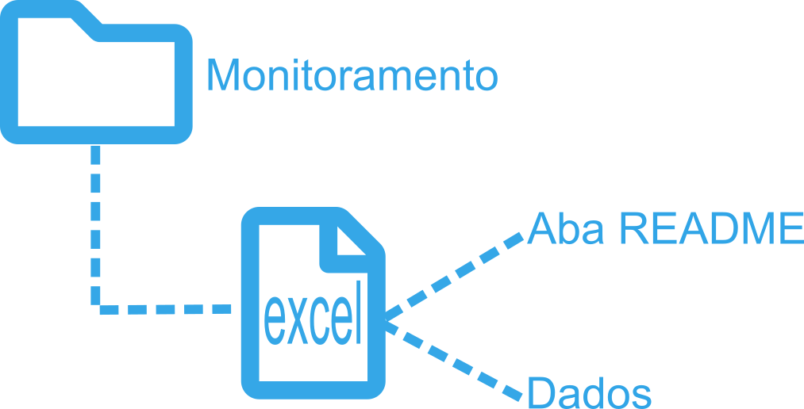
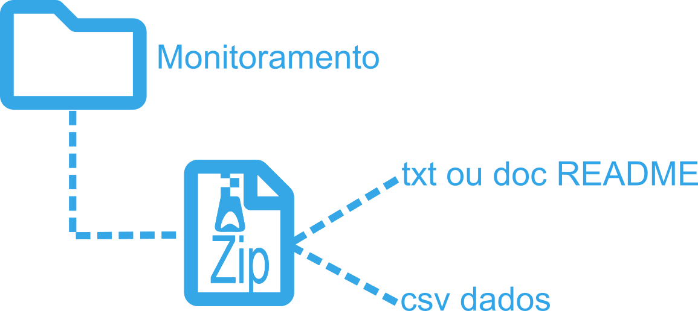
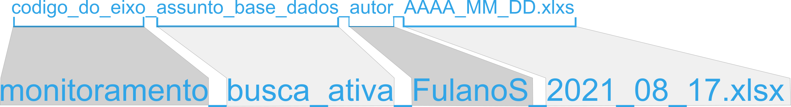
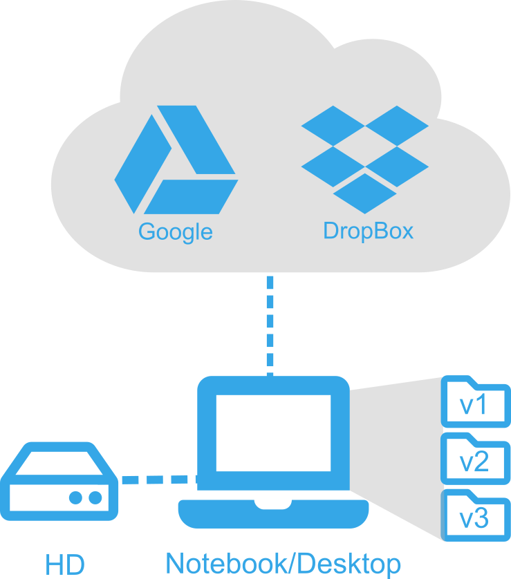

<style>
body {
text-align: justify}
</style>

```{r setup, include=FALSE}
knitr::opts_chunk$set(echo = TRUE)
remotes::install_github("mitchelloharawild/icons")
library(icons)
```


```{r, include=FALSE}
icon_check   <- icons::fontawesome$solid$`check`
icon_times   <- icons::fontawesome$solid$`times`
icon_alert   <- icons::fontawesome$solid$`exclamation-triangle`
```

# 1. Visão Geral

Este documento tem como objetivo registrar a politica de dados e padrões a serem seguidos pelos pesquisadores na formatação de dados produzidos no âmbito do **Projeto Coral Sol**.
<br><br>

***

# 2. Arquivos a serem produzidos **Projeto Coral**

Os banco de dados do **Projeto Coral Sol** será constituído por diferentes fontes, se subdividindo nos eixos de execução do projeto. Basicamente serão constituídos por arquivos excel, csv, fotografias e vídeos. Arquivos em formatos especiais também serão produzidos, como: shapefile, geotiFF e scripts.

<br>
  
## 2.1 Coordenadas e nomes de *sites*

A conferência de coordenadas e nomes de *sites* gerou um arquivo de referência. Este arquivo foi contruído e conferido com base em informações pessoais de pesquisadores, servidores do *icmbio* e estudos pretéritos. O formato a ser adotado para de coordendas geográficas registradas com o desenvolvimento do proejeto será em **graus decimais** e DATUM **WGS84**.

<br>

Este arquivo é uma versão inicial e são previstas revisões ao passo de execução do projeto.

Arquivo excel com as coordendas para cada **site** amostrados em estudos pretéritos.  

[fazer arquivo]()

  
## 2.2 Datas

O formato de registro de datas a ser adotado é dia, mês e ano **(DD/MM/AAAA)** em **colunas separadas** em planilhas excel.


## 2.3 Nomes de variáveis

Sugere-se que se use somente letras minúsculas com separação entre palavras usando "_".

Abaixo algumas sugestões de nomes de variáveis:

| Variável                             | Boa opção          | Evitar             |
|:-----------------------------------: |:------------------:|:------------------:|
| Temperatura máxima (graus Celsius)   | max_temp_c         | Maximun Temp (C°)  |
| Visibilidade horizontal (metros)     | vis_hrz_m          | visib (m)          | 
| Latitude (graus decimais)            | lat_DD             | lat                |
| Longitude (graus decimais)           | lon_DD             | lon                |

<br>

## 2.4 Nomes de espécies

Caso sejam resgistradas outras espécies nas campanhas de amostragem, e  estas sejam inseridas am algum campo da planilha, sugere-se que os nomes das identificações taxonômicas sejam confirmados utilizando-se funções do pacote **worms**.

<br>

Uma das maneiras de validar a classificação taxonômica e por meio do pacote **worms** (Ambiente R). 
Scripts de exemplo podem ser acessados [criarepositório]() do **LABAR**.


## 2.5 Arquivo ou aba README

Será adotado pelo **Projeto Coral Sol** que todos os arquivos de dados produzidos apresentem uma aba(caso excel) ou arquivo(.txt) **README**. A adição destas informações, ou **metadados** são importantes compreenssão do que está sendo apresentado no arquivo de dados. 

<br><br>


<br><br>

Neste [FAZER -- respositório fazer repo]() você pode acessar dois exemplos de bancos de dados com os **dados** e **metadados (README)**.  
<br><br>
  
## 2.6 Tipos de arquivos

Os dados dos diferentes grupos e variáveis amostradas no **Projeto Coral Sol** serão armazenadas em arquivos **excel**. Os arquivos tipo .xlsx são adequados para o armazenamento dos dados e são de fácil acesso e edição por todos os usuários do projeto. Também são poderão ser armazenados arquivos do tipo **.csv**, desde de que sigam as orientações a seguir. Além dos arquivos de dados, são armazenados também arquivos de fotos e vídeos.

<br><br>

Tipos de arquivos previstos que poderão ser gerados e armazenados:

| Tipo                                 | formato            |
|:-----------------------------------: |:------------------:|
| excel                                | .xlxs              |
| texto                                | .txt               |
| fotos                                | .jpg               |
| imagens(gráficos)                    | .jpg               |
| video                                | .MPEG-4            | 
| powerpoint                           | .ppt               |

  
***

# 3. Estrutura dos arquivos

<br><br>

## 3.1 Banco de dados simples

Abaixo um modelo simples de organização de dados para o eixo **monitoramento**:

<br><br>

 

<br><br>

Ainda no mesmo arquivo, sugere-se fortemente que seja adicionada uma aba **README**.

Caso sejam dados apresentados em formato .txt ou .csv, sugere-se a criação de uma pasta zip com dois arquivos: os dados e o arquivo **README**

  
<br><br>

[FAZER --- Arquivos de Exemplo](https://github.com/peld-iloc/data_example)
<br><br>
  
   
## 3.2 Bancos de Dados acompanhados de outras mídias (Fotos e Videos)

Algumas bases de dados são mais complexas e apresentam além de um arquivo com os dados, apresentam também pastas com fotos analisadas em Photoquad ou CPCe, registros de focos ou imagens de locais para referência.

Abaixo um modelo de organização proposto para o eixo **pesquisa**:


<br><br>
  
[FAZER -- Arquivos de Exemplo](https://github.com/peld-iloc/data_example)
<br><br>
  
  
## 3.3 Nomeando arquivos

Considerando os tipos de dados disponíveis, sugere-se que os arquivos sejam nomeados da seguinte maneira:
<br>
 


<br><br><br>
   
Com o objetivo de padronizar os nomes dos grupos, abaixo segue uma sugestão:
<br><br>
  
| Eixo                            | Tipo de informação                    | Sugestão de código para o grupo          |                           
|:-------------------------------:|:-------------------------------------:|-----------------------------------------:|
| monitoramento                   | dados de monitoramento e modelagem    | monitoramento                            |        
| modelagem                       | dados referentes à modelagem          | modelagem                                |
| pesquisa                        | dados referentes à pesqquisa          | pesquisa                                 |


<br><br>

***
  
# 4. Backup dos dados

Os dados armazenado de cada **eixo** serão salvos em um repositório do **Google Drive** a ser determinado. Para fins de segurança das informações produzidas durante a execução do projeto sugere-se que se aplique a regra do 3-2-1. 

<br>

+ **3 cópias diferentes ou versões**: três cópias com versões de diferentes períodos. Por exemplo, atualmente temos uma **versão 1** da pasta com todos os dados enviados. Um período de tempo ser definido, será gravadas novas versõe dos dados produzidos, **versão 2**, com todos o bancos de dados atualizados e conferidos. Após mais um período de tempo a ser definido, depois de novas aquisi **versão 3** temporal do conjunto de dados;

+ **2 tipos de mídias**: Ter a cópia das versões em mais de um tipo de mídia, por exemplo, HD/pen drive e um computador. De preferência que estes não fiquem no mesmo local.

+ **1 cópia em local externo**: Serviços como Google Drive ou DropBox. 
<br><br>
  
  

<br><br><br>
   


